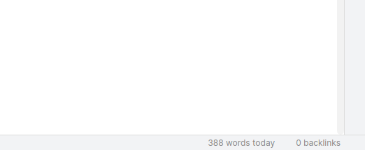

## Obsidian Daily Stats

This is a daily word count plugin for Obsidian (https://obsidian.md). You can see today's word count in the bottom right corner of your screen, and also see the historical logs. Currently the historical logs are available in the data.json, they will be integrated visually into the application in the next update.

This plugin was inspired by liamcain's [Calender](https://github.com/liamcain/obsidian-calendar-plugin) and lukeleppan's [Better Word Count](https://github.com/lukeleppan/better-word-count).

