## 1. Purpose and scope

This document describes how an Excalidraw drawing moves through the Obsidian Excalidraw plugin lifecycle:

- loading an `.excalidraw.md` file into an `ExcalidrawView`;
    
- tracking changes made in the live Excalidraw editor;
    
- marking the drawing dirty;
    
- serializing and saving it;
    
- receiving the resulting Obsidian `modify` event without unnecessarily reloading itself;
    
- synchronizing genuine incoming changes from Markdown editing, another view, or another source;
    
- refreshing embedded files and nested Excalidraw drawings;
    
- notifying Markdown embeds of a changed drawing;
    
- producing automatic PNG/SVG/raw Excalidraw exports;
    
- editing the Markdown "back" side from an Excalidraw embeddable;
    
- managing multiple views of the same file;
    
- unloading and closing a view;
    
- migrating a view between Obsidian windows;
    
- avoiding Electron freezes when a popout window disappears while asynchronous work is still running.
    

The main modules involved are:

- `src/view/ExcalidrawView.ts`
    
- `src/view/managers/ViewSaveCoordinator.ts`
    
- `src/view/managers/ViewSceneFileManager.ts`
    
- `src/view/managers/ViewExportManager.ts`
    
- `src/view/managers/CanvasNodeFactory.ts`
    
- `src/view/managers/MarkdownImageController.ts`
    
- `src/view/sidepanel/MarkdownImageEditor.ts`
    
- `src/shared/ExcalidrawData.ts`
    
- `src/shared/EmbeddedFileLoader.ts`
    
- `src/shared/ImageCache.ts`
    
- `src/shared/BackupPersistenceQueue.ts`
    
- `src/core/managers/FileManager.ts`
    
- `src/core/managers/EventManager.ts`
    
- `src/core/managers/ViewMigrationHandoffManager.ts`
    
- `src/core/managers/ViewMigrationPersistenceHandoffManager.ts`
    
- `src/core/managers/MarkdownPostProcessor.ts`
    
- `src/core/managers/PackageManager.ts`
    
- `src/core/main.ts`
    
- `src/types/excalidrawViewTypes.ts`
    

---

# 2. High-level mental model

The easiest way to understand the lifecycle is to stop thinking of "the drawing" as one object.

At runtime there are several representations of essentially the same document.

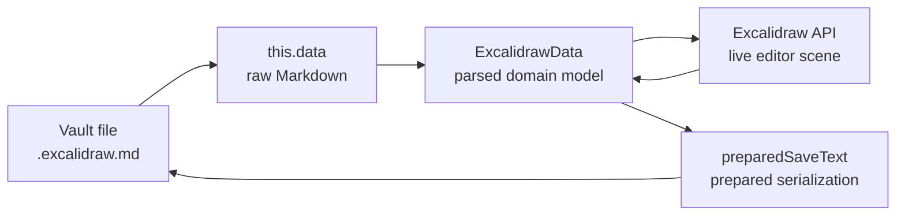

These layers deliberately serve different purposes.

### Vault file

The durable source of truth visible to Obsidian and external synchronization.

### `this.data`

Inherited from `TextFileView`.

It is the raw text buffer representing the Excalidraw Markdown file as the view currently understands it.

It is particularly important because an `.excalidraw.md` file contains more than the Excalidraw scene:

- frontmatter;
    
- text-element sections;
    
- element links;
    
- embedded-file definitions;
    
- local Markdown images;
    
- the compressed/uncompressed Excalidraw JSON;
    
- possibly other preserved Markdown content.
    

### `ExcalidrawData`

The parsed domain model.

It knows about:

- Excalidraw scene data;
    
- text elements;
    
- deleted elements;
    
- element links;
    
- embedded files;
    
- local Markdown images;
    
- equations;
    
- Mermaid content;
    
- file-level Excalidraw preferences;
    
- compression mode;
    
- selected element IDs.
    

This is the bridge between raw Markdown and the live Excalidraw editor.

### Live Excalidraw API state

The actual mutable editor state the user is interacting with.

This includes the current:

- elements;
    
- app state;
    
- binary files;
    
- viewport;
    
- selection;
    
- editing state.
    

This can be newer than both `ExcalidrawData` and the vault file while the user is drawing.

### `preparedSaveText`

A prepared serialized snapshot.

Obsidian's `TextFileView.getViewData()` is synchronous. Excalidraw serialization may perform asynchronous preparation, including compression work. Therefore the plugin prepares the string ahead of the `super.save()` call and lets `getViewData()` synchronously return that prepared string.

This is one of the most important architectural details in the save design.

---

# 3. Relationship to Obsidian `TextFileView`

`ExcalidrawView` extends Obsidian's `TextFileView`.

The public Obsidian contract provides:

- an in-memory `data: string`;
    
- `setViewData(data, clear)` for loading file content;
    
- `getViewData()` for returning content to save;
    
- `save()`;
    
- `onLoadFile()`;
    
- `onUnloadFile()`;
    
- `clear()`;
    
- `requestSave()`, documented as a debounced save request.
    

Obsidian explicitly describes `TextFileView` as a plaintext editable view and states that its normal behavior is save-on-close unless the implementation requests autosave.

The plugin cannot simply let `TextFileView` manage everything because an Excalidraw document has significantly more state than an ordinary text editor:

1. The live scene must first be reconciled into `ExcalidrawData`.
    
2. embedded binary files may need persistence;
    
3. deleted element tombstones must be preserved;
    
4. Markdown sections must be reconstructed;
    
5. compression can be asynchronous;
    
6. saving can cause a Vault `modify` event that must not immediately reload the saving view;
    
7. automatic exports and embed invalidation are secondary side effects;
    
8. window destruction can make ordinary view-owned asynchronous persistence unsafe.
    

Therefore `TextFileView` is used as the Obsidian integration bridge rather than as the complete persistence architecture.

---

# 4. The central architecture

There are now three relatively distinct responsibilities.

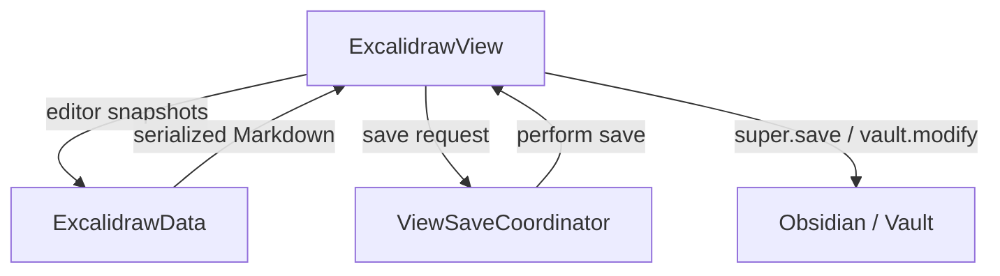

## `ExcalidrawView`

Still owns:

- the Excalidraw runtime;
    
- interaction with `TextFileView`;
    
- serialization;
    
- scene synchronization;
    
- special lifecycle branches;
    
- reload behavior;
    
- migration snapshots;
    
- most semaphores.
    

## `ViewSaveCoordinator`

Owns most of the save scheduling and concurrency policy:

- dirty revisions;
    
- autosave;
    
- force save;
    
- save request coalescing;
    
- tracking which revision is currently being saved;
    
- deciding whether a completed save actually makes the current scene clean.
    

## `ExcalidrawData`

Owns conversion between:

- raw Markdown;
    
- Excalidraw scene/domain metadata;
    
- generated Markdown.
    

This division is much cleaner than having a single giant `save()` method, although some old shared-state mechanisms still blur the boundaries.

---

# 5. Important temporary state

## 5.1 Document representations

|State|Meaning|
|---|---|
|`this.data`|Last raw `.excalidraw.md` text accepted by the view|
|`this.excalidrawData`|Parsed/domain representation|
|`this.excalidrawAPI`|Current live Excalidraw editor|
|`this.preparedSaveText`|Fully prepared text intended for the next `getViewData()`|
|`this.lastSavedData`|`TextFileView`'s notion of its previously persisted text|
|`deletedElements`|Deleted Excalidraw elements retained as tombstones for serialization/synchronization|

A useful rule is:

> `this.data` is not necessarily the newest drawing, and the live Excalidraw scene is not necessarily the newest Markdown document.

Both can legitimately be newer in different dimensions.

For example, while a Canvas-backed Markdown editor edits the back side of the same note:

- the Excalidraw API may contain the newest graphical scene;
    
- `this.data` may contain the newest Markdown-side edit;
    
- neither may yet exist completely on disk.
    

This is why naïvely treating any single representation as the sole runtime source of truth would lose data.

---

## 5.2 Save-version state

`ViewSaveCoordinator` maintains:

- `currentRevision`
    
- `savedRevision`
    
- `activeSaveRevision`
    
- `pendingSaveRequest`
    
- `saveLoopPromise`
    

This gives the save pipeline revision semantics rather than merely a Boolean dirty flag.

Conceptually:

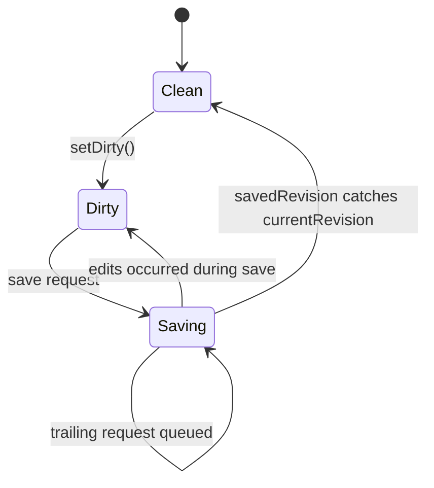

This is important because a user can continue drawing while an asynchronous save is in progress.

A save that started at revision 20 must not accidentally mark revision 21 clean.

The coordinator therefore retains at most:

- the current save;
    
- one merged trailing save request.
    

That bounded, latest-state approach is appropriate for an editor where saving every intermediate state independently would provide no value.

---

# 6. Semaphores

The semaphores in `ViewSemaphores` are effectively a second lifecycle/state machine layered over the revision coordinator.

The most relevant ones are:

|Semaphore|Purpose|
|---|---|
|`dirty`|File-path ownership marker for dirty state|
|`saving`|Coordinator-owned persistence exclusion flag retained in the compatibility container|
|`autosaving`|Autosave currently active|
|`forceSaving`|Explicit force-save operation active|
|`preventReload`|Consume the expected modify/reload resulting from this view's own save|
|`embeddableIsEditingSelf`|Same drawing's Markdown side is being edited from inside the drawing|
|`viewunload`|View teardown has started|
|`popoutUnload`|Teardown is associated with the last leaf in a popout|
|`windowMigrating`|View runtime is being recreated after crossing window realms|
|`justLoaded`|Suppresses dirty detection on the first Excalidraw `onChange` after load|
|`preventAutozoom`|Prevent viewport movement after an externally triggered reload|
|`isEditingText`|User is currently editing text|
|`shouldSaveImportedImage`|Recently imported image should trigger prompt persistence|
|`viewloaded`|View setup has completed|
|`scriptsReady`|Script lifecycle readiness|
|wheel/hover/import flags|Short-lived interaction state|

Several of these are not ordinary mutexes. They are better understood as event-causality hints.

In particular:

- `preventReload` says "the next relevant modify event is probably my own echo";
    
- `embeddableIsEditingSelf` says "a second editor is currently authoritative over part of this same Markdown file";
    
- `preventAutozoom` says "this reload is synchronization, not an intentional navigation event."
    

That distinction matters when evaluating future refactoring.

External lifecycle consumers no longer read these fields directly. `ExcalidrawView` exposes semantic queries for closing/migration state and same-file editing, plus a one-shot operation that consumes own-write reload suppression. Save-state queries delegate to `ViewSaveCoordinator.isSaveInProgress` and `ViewSaveCoordinator.isBusy`. `ViewSaveCoordinator` is now the sole internal owner of `saving`; synchronization uses a separate view-local `isSynchronizing` state. `isBusy` combines those operations with autosave where callers must retain the historical broad exclusion behavior.

---

# 7. Timers and timing-based guards

The lifecycle contains numerous deliberately short-lived states.

Important examples include:

|Mechanism|Approximate timing|Purpose|
|---|--:|---|
|`TextFileView.requestSave()`|2 s|Obsidian's own documented save debounce|
|`preventReload` reset|2 s|Avoid leaving self-save suppression armed forever|
|`embeddableIsEditingSelf` release grace|2 s|Allow final Markdown editor modify event to arrive|
|imported-image save flag|~3 s|Detect newly introduced binary files|
|`preventAutozoom`|~1.5 s|Protect viewport around reload|
|incoming sync waits for persistence/synchronization|until the active operation settles or lifecycle invalidates it|Avoid save/sync and overlapping-sync collisions without dropping the latest state|
|force save waits for busy state|up to ~5 s|Allow an existing save to finish|
|deferred file validation|~250 ms initial delay|Move dependency checking off critical rendering path|
|unresolved file retry|~2 s|Retry unresolved embedded dependencies|
|migration handoff TTL|15 s|Bound orphaned cross-window state|
|BAK persistence scheduling|~50 ms|Move IndexedDB backup off immediate save path|
|ordinary unload write|~200 ms|Defer persistence after teardown begins|

The large number of timer-based mechanisms reflects genuine asynchronous constraints in Obsidian/Electron, but it also creates one of the main areas where the lifecycle is difficult to reason about.

---

# 8. How a drawing becomes dirty

There are two primary classes of persisted state changes.

## 8.1 Element changes

`onExcalidrawIncrement()` handles meaningful durable element changes.

It ultimately calls:

`ViewSaveCoordinator.setDirty()`

This advances `currentRevision`.

This path also interacts with Markdown-image deletion tracking when image elements disappear.

## 8.2 Persisted app-state changes

Not all persistable drawing state is represented by element versions.

`onChange()` therefore compares selected persisted portions of Excalidraw app state against `previousTrackedAppState`.

This captures changes such as appropriate scene-level preferences without treating every transient Excalidraw UI state change as a document modification.

`previousSceneVersion` provides an additional element-scene baseline.

## First `onChange` after loading

`semaphores.justLoaded` prevents the initial scene installation from making the view dirty.

The first callback instead:

- clears `justLoaded`;
    
- captures the new baseline;
    
- may perform `zoomToFit()`.
    

---

# 9. Save triggers

Saving is not driven by one autosave timer alone.

The major triggers are:

|Trigger|Behavior|
|---|---|
|Excalidraw change|Marks dirty|
|Autosave timer|Saves an eligible dirty view|
|Window blur|Force save with autoexport enabled|
|Clicking away from canvas|Save if appropriate|
|File menu interactions|Save|
|Active-leaf change away from drawing|Save dirty drawing and invalidate its embeds|
|`onUnloadFile()`|Force save if required|
|`onClose()`|Final force save if required|
|Same-file embeddable begins editing|Force current drawing to disk first|
|Markdown image editor handoff/close|Flush editor, force save|
|Image import|Delayed force save so binary data becomes durable|
|Explicit force save|Save regardless of normal eligibility|

This is useful context when debugging "why was this drawing saved?" A dirty scene does not wait exclusively for the main autosave interval.

---

# 10. Autosave

`ViewSaveCoordinator` owns autosave scheduling.

The autosave timer evaluates whether saving is currently safe.

It avoids starting an autosave while, for example:

- text is actively being edited;
    
- a new element is being created;
    
- freehand drawing activity occurred very recently;
    
- a force save is active;
    
- another autosave is active;
    
- an embedded editor is editing the same drawing;
    
- global autosave is disabled.
    

If an active view remains dirty but is temporarily ineligible, the coordinator retries sooner rather than waiting an entire normal autosave interval.

This is an important UX property: a transient editing state postpones autosave rather than effectively resetting it for a long period.

---

# 11. Save request coalescing

`ViewSaveCoordinator` deliberately avoids launching arbitrary overlapping saves.

Incoming save requests are merged.

Conceptually:

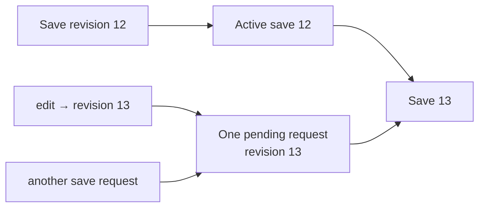

Force flags and save policies are merged appropriately while the target revision becomes the newest revision represented by the queue.

This solves a common asynchronous editor bug:

> Save A completes after edit B and incorrectly clears the dirty flag for edit B.

The revision model prevents that.

---

# 12. Core save pipeline

The actual persistence implementation remains in `ExcalidrawView.executeSaveRequest()`.

The normal sequence is approximately:

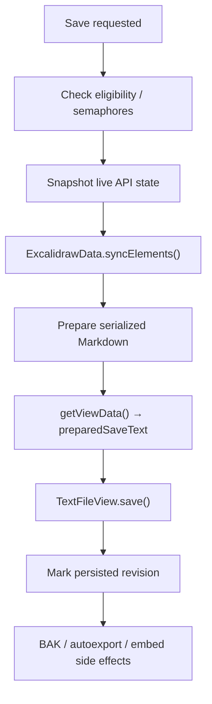

## 12.1 Eligibility

The save exits or waits in circumstances such as:

- view not loaded;
    
- same-file embeddable currently editing itself;
    
- another save operation active;
    
- file no longer exists;
    
- view lifecycle no longer permits ordinary persistence.
    

A force save can override selected restrictions.

---

# 13. Reconciling the live scene into `ExcalidrawData`

Before serialization:

`excalidrawData.syncElements(scene, selectedElementIds)`

updates the parsed/domain representation from the live Excalidraw scene.

This does more than assign `scene.elements`.

Among other things it can synchronize:

- files;
    
- text elements;
    
- links;
    
- cropped PDF state;
    
- embedded-file metadata;
    
- element link prefixes;
    
- preferences.
    

Embedded binary files can be written into the vault during this phase.

After binary data has been externalized, `scene.files` is cleared from the domain scene where appropriate so that the serialized Markdown uses Excalidraw's embedded-file representation instead of unnecessarily carrying all active runtime binary blobs.

### Why saving may reload the live scene

Some synchronization operations transform metadata or scene representation.

If `syncElements()` reports that this has occurred, the view may call `loadDrawing(...)` again so the live runtime reflects the canonicalized representation.

This internal reload is different from responding to a Vault `modify` event.

---

# 14. Preparing `getViewData()`

Obsidian requires:

```ts
getViewData(): string
```

to be synchronous.

The plugin therefore uses:

`prepareGetViewDataFromSnapshot(...)`

before invoking the base save.

It builds the final Markdown including:

- Excalidraw frontmatter/header;
    
- local Markdown image blocks;
    
- text elements;
    
- element links;
    
- embedded-file definitions;
    
- equations;
    
- Mermaid definitions;
    
- Excalidraw JSON;
    
- deleted elements;
    
- preserved tail content.
    

When the drawing is simultaneously being edited as Markdown in another view, compression can temporarily be disabled so that the Markdown-side experience remains workable.

After preparation:

```ts
preparedSaveText = result;
```

and:

```ts
getViewData() {
  return this.preparedSaveText ?? this.data;
}
```

can satisfy Obsidian synchronously.

This async-preparation/sync-getter bridge should be considered a fundamental constraint of the current architecture, not incidental complexity.

---

# 15. Normal persistence

For an ordinary save:

1. the final text is prepared into `preparedSaveText`;
    
2. `super.save()` invokes the Obsidian `TextFileView` persistence path;
    
3. `lastSavedData` and related base-class state can remain consistent with Obsidian;
    
4. the save coordinator advances the appropriate persisted revision;
    
5. backup/export/embed side effects follow according to save policy.
    

Obsidian's API deliberately presents `save()` and `getViewData()` as part of the `TextFileView` contract, so retaining this bridge is appropriate.

---

# 16. The self-save `modify` event problem

Writing the `.excalidraw.md` file causes Obsidian to emit a Vault `modify` event.

Without protection the sequence would become:

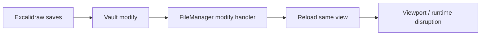

That would make every normal autosave look like an external edit.

The plugin uses `semaphores.preventReload` as a one-shot echo suppressor.

Normal save:

1. sets `preventReload`;
    
2. Obsidian emits `modify`;
    
3. the matching view's modify handler sees the flag;
    
4. it consumes the flag;
    
5. the view does not reload itself.
    

A timeout clears it after approximately two seconds in case the expected event never arrives.

This is practical, but it is causality inferred through timing rather than an explicit write token.

---

# 17. Incoming Vault changes

Vault `modify` events are routed approximately through:

- `EventManager`
    
- `FileManager.modifyEventHandler()`
    
- matching open `ExcalidrawView` instances.
    

For each view the handler asks:

- Is this the file represented by the view?
    
- Is the view unloading/migrating?
    
- Is this the expected echo of the view's own save?
    
- Is a same-file embedded editor currently authoritative?
    
- Should we synchronize incrementally or fully reload?
    

For modern `.excalidraw.md` files, genuine external modifications usually go through incremental synchronization.

Legacy/raw `.excalidraw` files are treated more like ordinary whole-file reloads.

---

# 18. Incremental synchronization

Incoming Markdown is read from the vault and parsed into a temporary `ExcalidrawData`.

The existing view then runs approximately:

`synchronizeWithData(incomingData)`

rather than replacing the entire live scene.

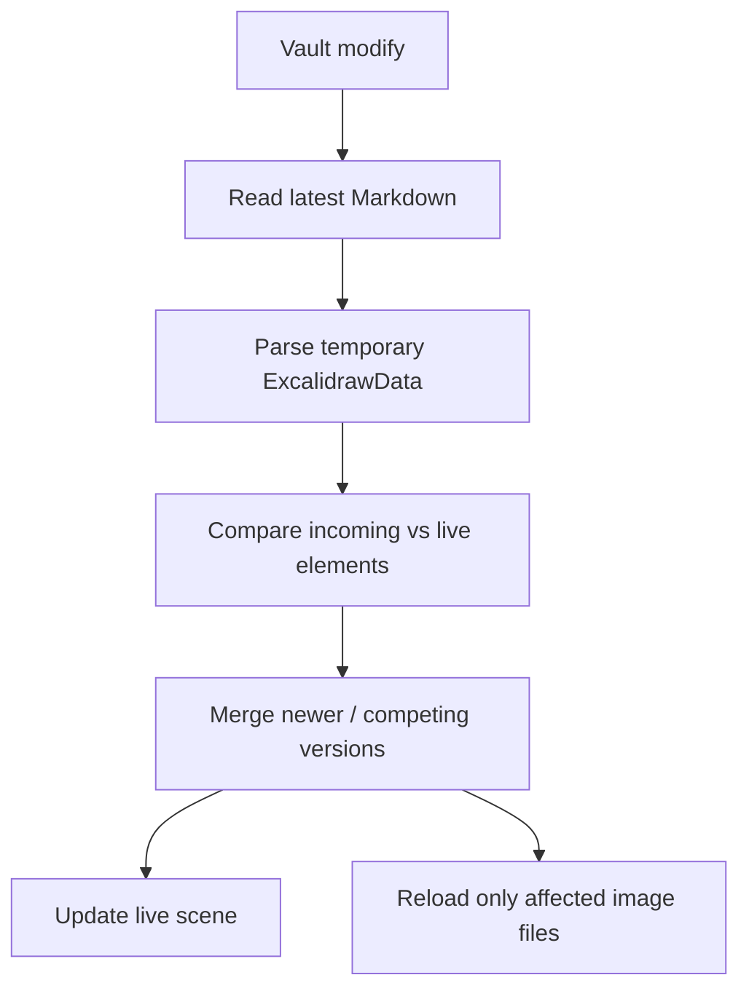

## Element reconciliation

For matching IDs:

- a higher incoming element version wins;
    
- a higher local version survives;
    
- equal-version but different content is treated as a competing version and the incoming version is accepted.
    

Incoming-only elements are inserted while respecting the incoming layer ordering as far as possible.

Incoming deletions remove the matching live elements.

Metadata associated with changed elements is also reconciled.

This is not a CRDT.

It is a pragmatic Excalidraw-version-based merge designed to avoid destroying newer local work while allowing the Markdown representation to change underneath an open graphical view.

---

# 19. Save versus incoming synchronization

`synchronizeWithData()` and persistence now have separate ownership states. `ViewSaveCoordinator` exclusively owns persistence execution through `semaphores.saving`, while the view-local synchronization path owns `isSynchronizing`.

`FileManager` now signals external synchronization by file and returns rather than reading, parsing, or retaining a waiter for the event-time contents. It targets initialized drawing views, excluding the `ExcalidrawLoading` placeholder that shares the same Obsidian view type but does not implement the drawing-view lifecycle contract. Each view retains at most one pending file path. The view waits for an active persistence operation or an earlier synchronization to settle, resolves the current `TFile`, then reads and parses the latest Vault text while owning synchronization state.

Queued persistence does not indefinitely outrank that marker. After an individual save completes, `ViewSaveCoordinator` yields to a pending external synchronization before starting a trailing save. Reconciliation can advance the dirty revision, and the trailing save then persists that combined latest state. This bounds synchronization latency even when edits continually replace the one trailing save request.

Another modify event received during that operation merely re-arms the same marker. The loop rereads the latest Vault state once more before completing, so work remains bounded to one active synchronization and one latest trailing request.

Same-file editing temporarily blocks acquisition but does not discard the marker. Once editing ownership and its release grace period end, the loop rereads and applies the latest Vault state without requiring another modify event. Lifecycle invalidation, file navigation, or loss of the view runtime still cancels work that no longer belongs to the active view. Expected own-save events are still filtered earlier by the separate reload-suppression mechanism.

---

# 20. Synchronization dirty reconciliation

There is a particularly important invariant spanning:

- `synchronizeWithData()`;
    
- `isSynchronizing`;
    
- `ViewSaveCoordinator.setDirty()`.
    
When the merged live scene differs from the incoming scene, the synchronization code intends to mark the view dirty so the locally surviving newer state can eventually be written back.

Synchronization no longer sets the persistence flag, and `ViewSaveCoordinator.setDirty()` no longer rejects revisions based on that flag. A reconciliation difference can therefore always advance the current revision, including after waiting for an older save. The resulting dirty revision is left for the existing autosave/flush paths to persist.

---

# 21. Full reload

`reload(...)` is used where incremental merge is not wanted or appropriate.

Important behavior includes:

- refusing reload during unsafe save/lifecycle states;
    
- reading the latest file content;
    
- parsing into `ExcalidrawData`;
    
- installing the new scene;
    
- preserving selected runtime state where appropriate;
    
- suppressing autozoom when the reload came from a file modification;
    
- clearing dirty state after a successful authoritative reload.
    

A malformed incoming file is intentionally not allowed to poison a working live scene: parsing happens before the current model is destructively replaced.

That is a valuable safety property.

---

# 22. `textFileViewLoadedFile`

`setViewData()` contains another defensive mechanism:

`textFileViewLoadedFile`

The comments document a situation where `TextFileView` can deliver modified file data after synchronization but before the plugin's own expected modify-handling sequence has completed.

The view avoids blindly reapplying that data and instead treats its explicit `reload()` path as the authoritative mechanism for an already loaded file.

This is another example of the plugin having to mediate between:

- Obsidian's general text-file lifecycle;
    
- Excalidraw's richer synchronization lifecycle.
    

---

# 23. Multiple views of the same file

This is an especially important case.

A single `.excalidraw.md` file can be open:

- as an `ExcalidrawView`;
    
- as a Markdown view;
    
- in multiple Excalidraw leaves;
    
- in an Excalidraw view plus its Markdown "back" side.
    

The code checks:

`getExcalidraAndMarkdowViewsForFile(...)`

to determine whether the file is open in more than one relevant view.

## Viewport behavior

During reload, if the file is open in multiple leaves, persisted:

- `scrollX`;
    
- `scrollY`;
    
- `zoom`
    

are stripped from the incoming app state before updating the live Excalidraw runtime.

Likewise the initial automatic `zoomToFit()` is suppressed when the drawing is represented by multiple Excalidraw/Markdown views.

The purpose is sound:

> A second editor changing or saving the same file should not unexpectedly reposition the user's graphical viewport.

Without this rule, changing the back side of a note in Markdown could cause the front-side Excalidraw view to jump to whatever viewport happened to be serialized elsewhere.

---

# 24. `suppressAutozoomOnce()`

Incoming file reloads call `suppressAutozoomOnce()`.

This is separate from `preventReload`.

- `preventReload` prevents a reload altogether.
    
- `suppressAutozoomOnce()` allows the reload but prevents it from behaving like an intentional file-open navigation.
    

This distinction is important.

Synchronization should update content without commandeering the user's camera.

Window migration has its own one-shot zoom suppression for the same reason.

---

# 25. Detecting Markdown-side editing

`isEditedAsMarkdownInOtherView()` detects another Markdown view for the same `TFile`.

This has consequences beyond viewport behavior.

For example, save serialization can temporarily avoid compressed scene data so that a person actively editing the `.excalidraw.md` file from Markdown is not presented with an unnecessarily opaque compressed block.

This is another example where "same file open twice" means coordinated representations, not merely duplicate views.

---

# 26. Same-file embeddables: editing the back side from the front

Excalidraw supports Obsidian Markdown content inside embeddable elements.

`CanvasNodeFactory` implements this by creating internal Obsidian Canvas file nodes.

For a same-file embed, this can literally mean:

> An Excalidraw drawing contains an editable Markdown representation of part of its own `.excalidraw.md` file.

This is a challenging synchronization problem.

The main protection is:

`semaphores.embeddableIsEditingSelf`.

---

# 27. `CanvasNodeFactory` and the Canvas hack

`CanvasNodeFactory` deliberately relies on Obsidian's internal Canvas implementation.

It:

1. accesses `app.internalPlugins.plugins.canvas`;
    
2. loads the Canvas plugin if needed;
    
3. creates a synthetic `WorkspaceSplit`;
    
4. creates a workspace leaf under the appropriate main/floating root;
    
5. creates a Canvas file node using `canvas.createFileNode(...)`;
    
6. renders that node;
    
7. removes the Canvas interaction blocker;
    
8. attaches its DOM to the Excalidraw embeddable.
    

Conceptually:


This is necessarily dependent on non-public Obsidian behavior.

There is currently no realistic recommendation to replace it with a clean public API if the required Canvas-node editing behavior is not exposed publicly.

The correct architectural goal is therefore containment of the hack rather than pretending the dependency can be removed.

`CanvasNodeFactory` already provides a reasonably useful isolation boundary for it.

---

# 28. Entering same-file embedded editing

When a Canvas node begins editing the current Excalidraw file:

`setEmbeddableNodeIsEditing()`

first sets the editing-self state and force-saves the drawing.

That force save is essential.

Otherwise:

1. the graphical scene could have unsaved changes;
    
2. the internal Markdown editor opens an older disk version;
    
3. the user edits that stale version;
    
4. its later save overwrites newer graphical content.
    

Therefore the sequence is intentionally:

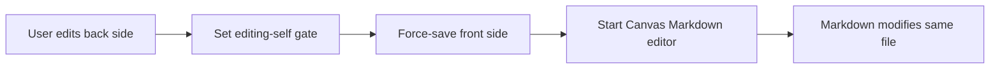

---

# 29. Leaving same-file embedded editing

`clearEmbeddableNodeIsEditing()` does not immediately clear the semaphore.

It provides roughly a two-second grace period.

This allows trailing editor saves/modify events to arrive before the Excalidraw view resumes normal interpretation of changes.

The behavior is necessary because the Markdown editor's visual "stop editing" event and its eventual disk write are not guaranteed to be the same event.

---

# 30. Special reload behavior while editing self

`reload()` contains a particularly subtle branch for `embeddableIsEditingSelf`.

When a same-file embedded editor has produced a modify event, the view can update:

`this.data = await vault.read(file)`

without immediately reparsing and reinstalling the Excalidraw scene.

That is exactly what is wanted.

The Markdown back side may have changed, so future saves need the current raw Markdown.

But replacing the front-side scene at that instant could overwrite or disrupt the live Excalidraw editor.

This branch effectively says:

> Accept the new raw document envelope, but do not yet treat it as an authoritative replacement for the live graphical scene.

---

# 31. Markdown image editor

The Markdown-image editor introduces another ownership/handoff lifecycle.

`MarkdownImageController` and `MarkdownImageEditorController` handle cases where locally stored Markdown sections correspond to rendered Excalidraw image elements.

Important behavior includes:

- deferred deletion prompts;
    
- converting between embedded notes and Markdown images;
    
- flushing Markdown editor state before ownership changes;
    
- rereading the vault after Canvas-node writes;
    
- updating `view.data`;
    
- force-saving when no other owner can be trusted to persist the new state.
    

The save path explicitly awaits a pending Markdown-image deletion decision so that persistence cannot race ahead of the user's keep/delete choice.

---

# 32. Re-arming `embeddableIsEditingSelf`

The Markdown image editor contains comments around a particularly tight race.

A flush may:

1. write Markdown;
    
2. force-save;
    
3. trigger a reload;
    
4. the reload path may clear editing-self state;
    
5. another autosave could then begin before the Markdown editor lifecycle has completely relinquished ownership.
    

The code therefore re-arms the editing-self state and then lets it expire through the normal grace period.

This works, but it illustrates that a Boolean plus timer is now carrying the responsibility of a multi-owner edit lease.

That will be relevant in the recommendations.

---

# 33. Image and embedded-file loading is a separate lifecycle

Saving the drawing file and loading its visual assets are deliberately separate concerns.

`ViewSceneFileManager` orchestrates `EmbeddedFilesLoader`.

It maintains:

- `activeLoader`;
    
- `nextLoader`;
    
- deferred-validation loaders;
    
- deferred timers;
    
- stale candidates;
    
- queued latest load requests;
    
- per-view Markdown image rendering cache.
    

The runtime identity check includes the Excalidraw API object itself, not just the file path.

This is important during window migration:

> A replacement view can open the same file while callbacks associated with the old runtime are still draining.

File path alone is therefore not a sufficient runtime identity.

---

# 34. Scene file loading strategy

The loader favors getting the scene visible quickly.

Conceptually:

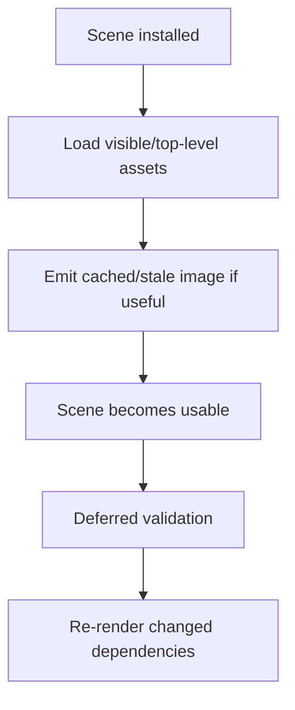

The system supports:

- prioritized visible assets;
    
- cached results;
    
- delayed validation;
    
- nested Excalidraw dependencies;
    
- targeted forced reloads;
    
- theme-dependent rendering;
    
- retries for unresolved targets.
    

This prevents nested file rendering from making every ordinary scene load fully synchronous.

---

# 35. `lastSceneLoadTime` and dependency freshness

Each view records:

`lastSceneLoadTime`.

When returning to an Excalidraw leaf, the plugin can compare embedded dependency modification times against that timestamp.

`getChangedTopLevelDependencyFileIDs()` checks both:

- direct embedded files;
    
- nested visual dependencies.
    

If a nested dependency changed, the system maps that change back to the top-level image `fileId` in the current scene.

Only those top-level images need regeneration.

This is substantially cheaper than blindly rebuilding every image whenever a view regains focus.

---

# 36. Manual "refresh scene images"

The `refresh-scene-images` command is deliberately not a drawing reload.

It:

1. identifies image elements/file IDs;
    
2. invokes `loadSceneFiles(...)`;
    
3. supplies those file IDs as forced reload targets.
    

Thus:

- element geometry is untouched;
    
- the drawing Markdown is not reparsed;
    
- the viewport is not reset;
    
- cached visual representations are rebuilt.
    

Theme changes use a related pathway with theme-aware image loading.

This is the correct conceptual split:

> Refreshing an image dependency is not the same operation as reloading the Excalidraw document.

---

# 37. Saving an Excalidraw file versus updating places where it is embedded

A saved Excalidraw drawing can itself be embedded in Markdown notes elsewhere.

Writing its source file is not sufficient to guarantee that every already-rendered Markdown embed immediately redraws.

The plugin therefore has an explicit notification mechanism.

`plugin.triggerEmbedUpdates(filepath?)`

finds rendered Excalidraw embeds and dispatches:

`RERENDER_EVENT`

to matching `.excalidraw-embedded-img` elements.

`MarkdownPostProcessor` listens for that event and reconstructs the rendered image.


The code deduplicates work by owner document, which matters for main-window and popout rendering.

This mechanism complements Vault modification events rather than duplicating them:

- Vault events synchronize file-backed editor state.
    
- `RERENDER_EVENT` invalidates already rendered Excalidraw embed DOM.
    

---

# 38. When embed updates are triggered

Examples include:

- leaving a dirty Excalidraw leaf after saving it;
    
- `forceSaveIfRequired()`, with a path-scoped update;
    
- explicit force-save policies;
    
- settings changes that invalidate rendered embeds.
    

There are both:

- path-scoped invalidations;
    
- global invalidations.
    

Path-scoped invalidation is preferable when the changed source file is known.

---

# 39. Autoexport

Automatic export is handled by `ViewExportManager`.

The save pipeline evaluates preferences for:

- PNG;
    
- SVG;
    
- raw `.excalidraw`;
    
- light/dark variants as configured.
    

A hook can adjust autoexport behavior.

The important architectural point is:

> The drawing's durable Markdown save and its PNG/SVG export are not one atomic transaction.

The save pipeline starts exports as side effects rather than awaiting them as part of file durability.

That is a reasonable performance decision.

An SVG render should not prevent the source `.excalidraw.md` file from being safely persisted.

---

# 40. Export file dependencies

Exports may need a different theme from the currently visible scene.

`ViewExportManager.loadFilesForExport(exportTheme)` can therefore use its own `EmbeddedFilesLoader` to obtain the binary representations appropriate to the target export theme.

That avoids assuming the live editor's currently loaded binary files are necessarily correct for the requested output.

---

# 41. Potential autoexport race

Because autoexports are launched asynchronously and are not part of the core persistence transaction, two successive saves can theoretically produce:

- export for revision N;
    
- export for revision N+1;
    

with revision N's slower render completing after N+1.

If both write the same PNG/SVG destination, an older export could theoretically become the final file.

I did not find a per-source, revision-aware export queue that guarantees latest-revision completion order.

This is not a reason to make source saving wait for exports. It is a reason to serialize/coalesce the export side effect independently.

---

# 42. Backup persistence

Normal saves can schedule a BAK copy through:

- `ImageCache`;
    
- `BackupPersistenceQueue`.
    

The backup queue is usefully designed around a bounded per-path model:

- one active IndexedDB write;
    
- one latest trailing payload.
    

The scheduling is deliberately slightly delayed.

The queue is owned outside an individual popout document and uses the main/global runtime, which is an important safety characteristic.

An empty scene intentionally does not overwrite an existing useful BAK. An empty source can be the result of a crash or damaged save, so preserving the previous non-empty backup is sensible.

---

# 43. View loading

`setViewData(data, clear)` starts the load lifecycle.

The signature must be synchronous because that is the `TextFileView` interface, but the implementation launches asynchronous initialization work.

Broadly it:

1. waits for plugin/runtime readiness;
    
2. checks `textFileViewLoadedFile`;
    
3. marks the view not fully loaded;
    
4. normalizes incoming data;
    
5. establishes save timestamps;
    
6. checks for migration handoffs;
    
7. parses or adopts `ExcalidrawData`;
    
8. loads the drawing;
    
9. initializes hooks/scripts;
    
10. marks the view loaded.
    

A migration-created replacement view can skip some ordinary disk reconstruction by adopting the transferred drawing state.

---

# 44. `clear()`

`clear()` handles the opposite boundary: the current file/editor state is being discarded.

It resets or destroys state including:

- `preparedSaveText`;
    
- Canvas nodes;
    
- references to embeddables;
    
- export dialogs;
    
- scene loaders;
    
- current scene state;
    
- `lastSceneLoadTime`;
    
- scene/app-state baselines.
    

Obsidian's public contract specifically expects `clear()` to remove editor-specific state when a different file is loaded.

---

# 45. `onUnloadFile()`

`ExcalidrawView.onUnloadFile()` intentionally does not simply rely on the base `TextFileView` implementation.

The code comments explicitly avoid `super.onUnloadFile()` because Excalidraw manages its own saving during unload.

It performs work such as:

- flushing Markdown-image editor state;
    
- waiting for conflicting persistence state;
    
- force-saving if required;
    
- avoiding inappropriate work during window migration.
    

This is a consequence of Excalidraw having a richer persistence pipeline than the generic text-view save.

---

# 46. `onunload()` versus `onClose()`

There are multiple teardown callbacks in play.

Obsidian's `View` lifecycle provides `onClose()`, while views/components also participate in Obsidian's component load/unload lifecycle. ([Developer Documentation](https://docs.obsidian.md/Reference/TypeScript%20API/View/onClose "onClose - Developer Documentation"))

The plugin's comments and implementation operate on the observed ordering in which `onunload()` can begin dismantling the view before the final `onClose()` logic completes.

The code must therefore be robust against partial teardown.

## `onunload()`

Broadly:

- calls `super.onunload()`;
    
- marks `viewunload`;
    
- determines whether this is the last leaf of a popout;
    
- clears timers;
    
- terminates loaders;
    
- removes observers/listeners;
    
- destroys autosave scheduling;
    
- invokes unload hooks.
    

## `onClose()`

Broadly:

- handles repeated close calls defensively;
    
- performs final force-save if applicable;
    
- exits fullscreen;
    
- unmounts React;
    
- destroys scene loaders;
    
- disconnects scripts/EA references;
    
- removes Canvas nodes;
    
- releases `ExcalidrawData`;
    
- releases the package lease;
    
- finally calls `super.onClose()`.
    

A useful distinction is:

> `onunload()` begins making the runtime unsafe to continue normal work; `onClose()` is the final resource-release and save boundary.

The exact internal Obsidian ordering should not be treated as a formally documented guarantee. The plugin correctly needs its own idempotence and lifecycle flags.

---

# 47. Why popout teardown is special

Electron popout windows are not merely DOM containers.

A view can own objects originating in that window realm:

- `Window`;
    
- `Document`;
    
- DOM nodes;
    
- React roots;
    
- event listeners;
    
- objects whose callbacks close over that realm.
    

During popout destruction, Electron can invalidate the source browser/window context before asynchronous work initiated by the view has completed.

The repository comments identify a particularly severe outcome:

> continuing asynchronous synchronization/compression/filesystem work while retaining objects associated with the destroyed popout can freeze Obsidian/Electron.

This changes the normal "save before close" design assumption.

Waiting for every asynchronous operation before tearing down the old window is not necessarily the safe choice.

---

# 48. Package leases preserve explicit window identity

`PackageManager.acquirePackage(win)` returns a `PackageLease` containing the actual source `Window`.

The important detail is that teardown does not need to rediscover the view's window through mutable DOM after the DOM may already have migrated or disappeared.

The lease:

- records the window explicitly;
    
- keeps per-window compatibility aliases alive while needed;
    
- removes the alias when the final view in that window releases its lease.
    

This explicit ownership is much safer than repeatedly asking `containerEl.ownerDocument.defaultView` late in teardown.

---

# 49. Window migration

The window migration path deserves to be considered a separate lifecycle from ordinary reload.

Before the first asynchronous wait, the migration handler:

1. marks `windowMigrating`;
    
2. stops relevant loaders/timers;
    
3. synchronously captures the live Excalidraw state;
    
4. captures a save snapshot if necessary;
    
5. unmounts the React root.
    

The ordering is intentional.

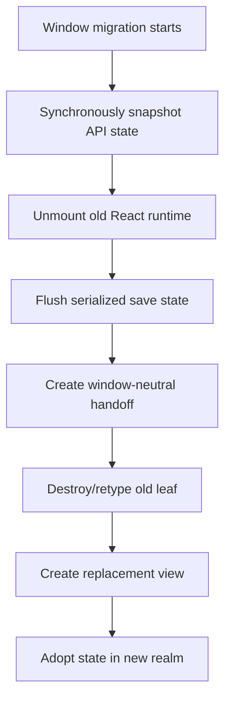

The key invariant is:

> Do not perform lengthy awaits while the old rendered runtime still owns the source popout realm.

That is one of the strongest architectural constraints in the entire file lifecycle.

---

# 50. Drawing migration handoff

`ViewMigrationHandoffManager` transfers drawing state between the destroyed and replacement views.

The handoff contains drawing-owned data such as:

- elements;
    
- app state;
    
- binary files;
    
- `ExcalidrawData` migration state;
    
- save coordinator migration state;
    
- file identity and modification time.
    

It explicitly never retains:

- an `ExcalidrawView`;
    
- React root;
    
- DOM node;
    
- listener;
    
- `Window`;
    
- package lease.
    

The payload is:

- tokenized;
    
- bound to leaf/file identity;
    
- checked against file `mtime`;
    
- one-shot;
    
- automatically expired after 15 seconds.
    

This is an excellent boundary.

Cross-window state should be data, not runtime ownership.

---

# 51. Persistence migration handoff

There is a second manager:

`ViewMigrationPersistenceHandoffManager`.

Its payload is even smaller:

- `leafId`;
    
- `filePath`;
    
- serialized `data`.
    

Again, no view/window/DOM references are retained.

Its purpose is specifically to let persistence move out of the old popout realm.

If migration originates in a popout, `executeSaveRequest()` can register the serialized drawing instead of calling the normal `TextFileView.save()` from the dying view.

The replacement view consumes that text and performs:

`vault.modify(...)`

from the surviving/main runtime.

This directly addresses the Electron freeze class of bug.

---

# 52. Why `super.save()` is deliberately bypassed during migration

`TextFileView.save()` is normally desirable because it keeps Obsidian's internal view/file state synchronized.

But during a window migration, calling it from the source view can keep the source realm involved in asynchronous native/file operations.

The migration branch therefore prioritizes realm safety:

```text
Old popout:
    snapshot → serialize → transfer plain data → die

New/main realm:
    consume plain data → vault.modify()
```

This is a sound exception to the otherwise desirable `TextFileView` persistence path.

---

# 53. Binary files after migration

Large image binaries are not all required before the replacement Excalidraw runtime can appear.

Migration publication prioritizes visible files and publishes binary files in small batches.

This avoids replacing one freeze problem with another:

> a successfully migrated view that blocks its first paint while decoding every embedded image.

The new runtime can become interactive and then progressively receive its binary files.

If the migration state does not supply everything, the ordinary scene-file loader remains the fallback.

---

# 54. Ordinary unload persistence is weaker than migration persistence

There is another special branch when:

`viewunload`

is true outside window migration.

The current implementation:

1. serializes the drawing;
    
2. captures the required file/data references;
    
3. schedules a `vault.modify()` approximately 200 ms later;
    
4. immediately reports a `"view-unload-scheduled"` save result.
    

This avoids doing the actual write synchronously inside the disappearing view lifecycle.

However, this branch is less robust than the migration handoff.

The save coordinator can advance `savedRevision` once the delayed write has merely been scheduled, before that write has actually completed.

If the asynchronous write later fails:

- the view is already gone;
    
- the revision was already treated as transferred/saved;
    
- the normal backup path did not necessarily run.
    

This is the most important persistence-hardening opportunity I found.

---

# 55. Active leaf changes

`EventManager.onActiveLeafChangeHandler()` participates in persistence and refresh.

When leaving a dirty Excalidraw view for another leaf, it can:

- save the drawing;
    
- trigger embed updates for its path.
    

When entering an Excalidraw view, a delayed check determines whether visual dependencies changed while the drawing was inactive.

If necessary, only affected file IDs are scheduled for deferred validation/re-rendering.

There is also logic recognizing a recent Markdown ↔ Excalidraw split-view switch for the same file.

This prevents normal front/back editing activity from being mistaken for a stale, inactive view requiring aggressive replacement.

---

# 56. Five-minute stale-view heuristic

The modify handler distinguishes an actively coordinated split-edit situation from a much older/inactive view.

For a sufficiently stale view — around five minutes relative to its last save timestamp — it can favor a full reload rather than attempting indefinite chains of incremental synchronization.

That is a pragmatic tradeoff.

Incremental merge is valuable while the user is actively working in related views. It is less valuable to preserve the historical runtime state of a view that has effectively been dormant while the file changed repeatedly elsewhere.

---

# 57. Overall save/reload causality

The complete normal cycle can be summarized as:

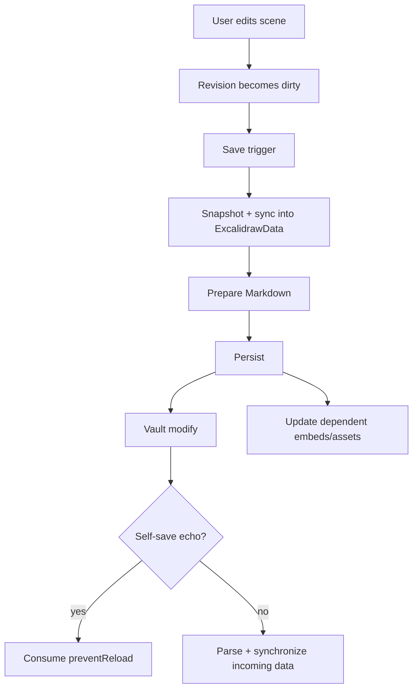

The central principle is:

> Saving and reloading are not inverse operations.

A save updates durable state.

A reload/synchronization decides how durable state should influence an already-running editor.

That second decision depends on source, view ownership, dirty state, viewport state, and same-file editing.

---

# 58. Main architectural strengths

Several parts of the current implementation are already strong.

## Revision-aware save coordination

The move to `ViewSaveCoordinator` prevents ordinary overlapping-save races and gives a much better definition of "clean" than a Boolean dirty flag.

## Immutable migration handoffs

`ViewMigrationHandoffManager` and `ViewMigrationPersistenceHandoffManager` establish exactly the right cross-window boundary: transferable data without runtime/window ownership.

## Early popout unmount

Snapshot-before-await and unmount-before-long-async-work directly addresses the Electron browser freeze problem.

## Separation of source persistence and visual dependency loading

`ViewSceneFileManager` does not confuse "the drawing Markdown changed" with "an image needs re-rendering."

## Incremental external synchronization

Element-version reconciliation avoids unnecessarily destroying local runtime state when another representation of the file changes.

## Multi-view viewport protection

Suppressing persisted viewport restoration/rezoom when another Excalidraw/Markdown view shares the file is the right UX behavior.

## Explicit embed invalidation

`RERENDER_EVENT` solves a problem Vault file events alone cannot solve reliably: stale already-rendered Markdown DOM.

## Canvas hack containment

The dependency on internal Canvas APIs is mostly concentrated in `CanvasNodeFactory` instead of being spread indiscriminately through `ExcalidrawView`.

---

# 59. Main architectural weaknesses

## 59.1 Self-save detection is timing based

`preventReload` works but represents expected causality as:

- Boolean;
    
- next event;
    
- two-second timeout.
    

An unrelated external modification arriving in that window can theoretically be mistaken for the view's own echo.

---

## 59.2 Same-file editing is represented by one Boolean

`embeddableIsEditingSelf` is used by multiple related systems:

- Canvas-backed embeddables;
    
- Markdown image editor;
    
- reload logic;
    
- autosave;
    
- save restrictions.
    

The need to clear and then re-arm it around some transitions indicates that the true concept is an ownership lease rather than a Boolean.

---

## 59.3 Ordinary unload persistence is only scheduled, not durably handed off

The migration code has a strong plugin-level handoff model.

Ordinary unload still uses a delayed view-originating write and treats scheduling as successful persistence.

These two solutions should converge.

---

## 59.4 Autoexport lacks revision ordering

Exports are correctly non-blocking, but there is no obvious guarantee that older asynchronous export work cannot finish after newer work.

---

## 59.5 Async `setViewData()` lacks an explicit load generation

`setViewData()` launches asynchronous work from a synchronous lifecycle method.

There are several guards against stale application, but a monotonically increasing load-generation token would make cancellation/staleness semantics considerably clearer.

---

## 59.6 Timer ownership is difficult to audit

There are many timers with substantially different safety requirements:

- editor UX timers;
    
- view-owned debounce timers;
    
- dependency validation;
    
- persistence;
    
- migration expiry;
    
- backups.
    

Whether a timer is allowed to depend on a popout `Window` is an architectural property, but that property is currently implicit at many call sites.

---

# 60. Recommended refactoring

The goal should not be a wholesale rewrite.

The existing architecture contains several carefully accumulated Obsidian/Electron workarounds that should be preserved.

I would make the following changes incrementally.

---

# 61. Priority 1 — generalize the safe persistence handoff

The strongest existing mechanism is the migration persistence handoff.

Generalize that idea into a plugin-owned persistence queue, for example:

`DetachedViewPersistenceQueue`

or:

`ViewPersistenceHandoffManager`.

Its request should contain only immutable/stable values:

```ts
interface PersistenceRequest {
  filePath: string;
  data: string;
  revision: number;
  reason: "window-migration" | "view-unload";
  backupData?: string;
}
```

It must not retain:

- `ExcalidrawView`;
    
- `Window`;
    
- `Document`;
    
- DOM;
    
- React runtime;
    
- package lease.
    

For ordinary active saves, continue using `super.save()`.

For a dying/migrating window:

```text
view → serialized immutable payload → plugin/main-realm queue → Vault
```

The queue then owns:

- `vault.modify`;
    
- error handling;
    
- optional BAK scheduling;
    
- coalescing newer requests for the same path.
    

This would eliminate the current weak `"view-unload-scheduled"` semantics without reintroducing the popout freeze.

The view should be allowed to consider the revision:

> handed off to a durable plugin-owned persistence process

rather than pretending it has already physically reached disk.

This is the single improvement I would prioritize most.

---

# 62. Priority 2 — split `saving` from `synchronizing` (implemented)

The save coordinator remains in place and is now the authoritative internal owner of persistence state.

The implementation uses separate states:

```ts
saveCoordinator.isSaveInProgress
view.isSynchronizing
```

The resulting invariants are:

- persistence cannot begin certain synchronization stages;
    
- synchronization can queue behind persistence;
    
- synchronization itself does not prevent `setDirty()` from advancing the document revision.
    

The important objective is:

> A function that decides whether a document revision changed should not depend on a Boolean whose current owner might be the synchronization subsystem.

This directly resolves the `synchronizeWithData()` / `setDirty()` ambiguity.

---

# 63. Priority 3 — queue one pending external synchronization (implemented)

Do not introduce a CRDT.

That would be disproportionate to the problem and would not fit the current environment.

When a genuine Vault modification arrives while saving, the implementation now:

1. records that an external refresh is pending;
    
2. retains only the newest event/path;
    
3. once saving finishes, rereads the current file with `Vault.read()`;
    
4. synchronizes that newest state.

The same marker also remains pending while a same-file embedded editor owns the document. It resumes after the edit guard releases rather than requiring a later modify event to recover the skipped update.
    

The view-owned state is intentionally bounded:

```ts
pendingExternalSyncPath: string | null
```

because the vault itself stores the newest authoritative text.

No unbounded queue is necessary.

This removes the previous possibility of losing an external modification merely because persistence or synchronization remained busy for three seconds.

Obsidian's own guidance recommends using Vault reads when working with current file contents rather than relying on potentially stale cached copies, which aligns well with this reread-latest approach. ([Developer Documentation](https://docs.obsidian.md/Plugins/Vault "Vault - Developer Documentation"))

---

# 64. Priority 4 — make self-save echo suppression content-aware

Obsidian does not provide an origin token on a generic Vault `modify` event, so perfect causal identification is not available.

However, `preventReload` can be stronger than a Boolean timer.

The first timing reduction is implemented: save text is fully prepared before suppression is armed. The Boolean now covers only the live `TextFileView` write and its short post-write cleanup interval, rather than asynchronous compression as well. A failed write clears it immediately. This materially narrows false consumption but does not identify which view produced a same-path event.

For each source path, store an expected write record such as:

```ts
{
  revision,
  contentHash,
  expectedMtime
}
```

When the modify arrives:

- read/compare the relevant identity;
    
- consume it only if it matches the expected save;
    
- otherwise process it as a genuine external change.
    

Keep the existing timeout as cleanup.

This substantially reduces the chance that an unrelated edit arriving during the two-second window is accidentally swallowed.

---

# 65. Priority 5 — turn `embeddableIsEditingSelf` into a lease

The current behavior is fundamentally reference ownership.

Represent it that way.

For example:

```ts
sameFileEditGate.acquire(ownerId)
sameFileEditGate.release(ownerId, { graceMs: 2000 })
sameFileEditGate.isActive
```

Possible owners:

- Canvas embeddable element ID;
    
- Markdown image editor ID;
    
- sidepanel editor.
    

The gate becomes inactive only when the last owner has released it.

This prevents:

- one editor clearing another editor's protection;
    
- awkward clear/re-arm sequences;
    
- uncertainty around timer ownership.
    

The existing two-second grace period can remain.

The refactor changes representation, not behavior.

---

# 66. Priority 6 — introduce an explicit save snapshot type

There are currently several pieces of save-time temporary state.

Formalize them:

```ts
interface PreparedSaveSnapshot {
  revision: number;
  filePath: string;
  elements: readonly ExcalidrawElement[];
  deletedElements: readonly ExcalidrawElement[];
  appState: AppState;
  selectedElementIds: Record<string, boolean>;
  serializedText?: string;
}
```

The desired lifecycle becomes:

```text
Live API
   ↓ capture
PreparedSaveSnapshot
   ↓ normalize/sync
ExcalidrawData
   ↓ serialize
PreparedSaveSnapshot.serializedText
   ↓
getViewData / persistence handoff
```

This would make the distinction between:

- `this.data`;
    
- `preparedSaveText`;
    
- `lastSavedData`;
    
- live scene;
    
- migration snapshot
    

much easier to audit.

It would also make autoexport-by-revision easier.

---

# 67. Priority 7 — give `setViewData()` a generation token

Because `setViewData()` starts asynchronous work from a synchronous API callback:

```ts
const generation = ++this.loadGeneration;
```

After every significant `await`:

```ts
if (generation !== this.loadGeneration || file !== this.file) return;
```

Increment the generation again during:

- `clear()`;
    
- close;
    
- migration;
    
- a new file load.
    

This is simple and would complement rather than replace `textFileViewLoadedFile`.

`textFileViewLoadedFile` can continue to represent the semantic Obsidian-modify special case.

The generation token answers a different question:

> Is this asynchronous initialization still the initialization belonging to the current runtime?

---

# 68. Priority 8 — serialize/coalesce autoexport separately

Keep autoexport non-blocking.

Add a plugin-level or manager-level queue keyed by:

```text
source path + export format + theme
```

Behavior:

- only one active export per key;
    
- retain only the newest pending scene revision;
    
- older output must never overwrite a newer completed export.
    

Ideally pass the actual persisted save snapshot to the exporter rather than asking the live view for whatever scene happens to exist later.

This yields a clear invariant:

> Export revision N corresponds to save snapshot N.

without delaying `.excalidraw.md` persistence.

---

# 69. Priority 9 — unify BAK behavior with persistence ownership

Normal saves currently have a sensible BAK pipeline, while migration/direct teardown branches are less consistent.

If detached persistence moves into a main-realm queue, that queue can also schedule the BAK after successful persistence.

Continue preserving the current rule:

> Do not replace a known useful backup with an empty scene.

The important change is not backup policy; it is making backup invocation independent of which persistence branch happened to save the file.

---

# 70. Priority 10 — path-scope embed invalidation wherever possible

`triggerEmbedUpdates(filepath)` already supports targeting.

Prefer it whenever the source drawing is known.

Reserve global:

`triggerEmbedUpdates()`

for cases where:

- settings invalidate all Excalidraw renderings;
    
- the affected path genuinely cannot be determined.
    

This is especially useful in vaults with many rendered Excalidraw embeds.

---

# 71. Priority 11 — preserve the dependency refresh fallback

It would be possible to build an increasingly sophisticated dependency graph from Vault modify events.

That may improve targeted refresh further, but it should not replace the existing focus-time timestamp validation.

Obsidian:

- caches Markdown;
    
- has internal Canvas behavior;
    
- supports plugins that modify files through many paths;
    
- can miss runtime events while views are inactive.
    

Therefore retain:

`lastSceneLoadTime` + dependency mtime scan

as a recovery mechanism even if more proactive invalidation is added.

A hybrid design is more realistic than assuming a perfect event-driven dependency graph.

---

# 72. Priority 12 — make timer ownership explicit

A small abstraction could classify timers:

### View/UI timers

Safe to disappear with the view:

- hover;
    
- text editing;
    
- resize;
    
- interaction debounces.
    

### Scene-loader timers

Owned by `ViewSceneFileManager` and cancelled when runtime identity changes.

### Plugin/durability timers

Must not rely on a popout realm:

- persistence handoff;
    
- BAK;
    
- migration expiration;
    
- delayed detached persistence.
    

The key rule should be documented in code:

> Anything required for durability after view teardown must be owned by plugin/main-runtime infrastructure, never by the source popout window.

This is more important than whether the timer helper itself is centralized.

---

# 73. Priority 13 — strengthen `CanvasNodeFactory`, do not try to remove it

The Canvas implementation is an unavoidable private-API compatibility layer under current Obsidian constraints.

Keep it isolated.

Potential strengthening:

- centralize all `app.internalPlugins.plugins.canvas` access there;
    
- perform capability checks at initialization;
    
- fail gracefully if an expected method disappears;
    
- keep Canvas node and synthetic leaf teardown entirely inside the factory;
    
- expose a narrow interface to `CustomEmbeddable`;
    
- avoid leaking raw Canvas implementation objects elsewhere.
    

Do not attempt to replace this with a public API abstraction that does not actually offer equivalent behavior.

---

# 74. Recommended invariant tests

The lifecycle is complicated enough that refactoring should be driven by invariants rather than large end-to-end tests alone.

At minimum, test these scenarios.

## Saving while editing continues

- revision 10 starts saving;
    
- revision 11 is created;
    
- save 10 completes;
    
- view must remain dirty;
    
- trailing save eventually persists 11.
    

## Self-save modify

- save produces a Vault modify;
    
- saving view must not reload;
    
- another view of the same file must still receive the update.
    

## External modify during save

- genuine external edit arrives while save is busy;
    
- latest vault state must eventually be synchronized;
    
- event must not simply disappear after the timeout.
    

## Same-file front/back editing

- Excalidraw has unsaved graphical changes;
    
- embedded Markdown editor opens;
    
- graphical state is persisted before Markdown editing begins;
    
- Markdown modification updates `this.data`;
    
- front-side viewport/scene is not unnecessarily replaced.
    

## Multiple views

- one Excalidraw view and one Markdown view open same file;
    
- Markdown change causes synchronization;
    
- Excalidraw camera does not jump;
    
- automatic zoom does not run.
    

## Two Excalidraw views

- one saves;
    
- other synchronizes;
    
- saving view consumes its own echo;
    
- neither loses newer local element versions.
    

## Image refresh

- nested embedded dependency changes;
    
- top-level image file ID is detected;
    
- only affected render is rebuilt;
    
- drawing scene/viewport does not reload.
    

## Autoexport ordering

- revision N starts slow PNG export;
    
- revision N+1 starts;
    
- final export on disk must represent N+1.
    

## Normal popout close

- dirty view closes;
    
- source `Window` becomes invalid;
    
- persistence continues from plugin/main owner;
    
- final vault content is correct.
    

## Window migration

- dirty source popout begins migration;
    
- runtime is snapshotted before await;
    
- old React tree is unmounted early;
    
- no handoff retains `Window`;
    
- replacement consumes drawing and persistence state;
    
- viewport does not unexpectedly zoom;
    
- binary files arrive progressively.
    

## Handoff expiry

- replacement never consumes token;
    
- data disappears after TTL;
    
- no view/window objects remain retained.
    

## Synchronization dirty reconciliation

Specifically test the current `synchronizeWithData()` case where:

- incoming scene contains an older version of an element;
    
- newer local element survives;
    
- merged scene differs from incoming disk state;
    
- view must become/remain dirty so the newer local state is eventually persisted.
    

This test validates that the separated persistence/synchronization ownership continues to preserve the reconciliation dirty revision.

---

# 75. Suggested target architecture

The code does not need a radically different model.

A realistic final structure would be:

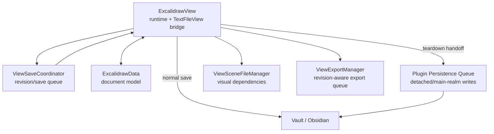

The responsibilities would be:

### `ExcalidrawView`

- own the live Excalidraw runtime;
    
- bridge `TextFileView`;
    
- capture/load scenes;
    
- decide viewport behavior;
    
- coordinate same-file editors.
    

### `ViewSaveCoordinator`

- own revision/dirty state;
    
- own save queue;
    
- own autosave;
    
- expose clear save-state semantics.
    

### `ExcalidrawData`

- own parsing/generation/domain reconciliation.
    

### Plugin-level persistence queue

- own writes that must survive view/window death;
    
- own detached-save errors;
    
- own post-persistence BAK;
    
- never retain Window/View objects.
    

### `ViewSceneFileManager`

- own visual dependency refresh.
    

### Export queue

- own PNG/SVG/raw export ordering independent of source durability.
    

This is close enough to the current implementation that it can be reached incrementally.

---

# 76. What should not be changed

Several tempting simplifications would actually make the implementation less correct.

## Do not replace `TextFileView`

It remains the right Obsidian-facing abstraction.

The plugin simply needs extra coordination around it.

## Do not make every Vault modify perform a full reload

That would destroy:

- local runtime continuity;
    
- viewport stability;
    
- split Markdown/Excalidraw editing UX.
    

## Do not make source save await all image/export work

Durability of `.excalidraw.md` should remain the priority.

## Do not wait on old popout-owned asynchronous work before tearing down the runtime

The existing migration comments make clear why this can freeze Electron.

Transfer immutable state instead.

## Do not introduce a full collaborative CRDT merely to handle Vault modifications

Excalidraw element versions plus a latest-file synchronization queue are sufficient for the current Obsidian environment.

## Do not remove the Canvas-node implementation on architectural purity grounds

The required Obsidian capability is internal.

Contain and defend the hack instead.

## Do not restore viewport information indiscriminately during synchronized reloads

The current multi-view camera protection is intentional and important.

---

# 77. Multiple-device and multiple-view synchronization scenarios

Two important synchronization scenarios are worth making explicit because they exercise several of the lifecycle mechanisms described above.

## 77.1 Same drawing edited on multiple devices

A common case is the same `.excalidraw.md` file being edited independently on multiple devices, for example:

* desktop;

* iPad;

* synchronized through Obsidian Sync or another file synchronization mechanism.

The devices do not share a live collaborative session.

Each device can temporarily contain newer local scene state while receiving a different version of the same vault file from synchronization.

When such an incoming Vault modification reaches an open `ExcalidrawView`, the live scene should therefore not be replaced blindly.

This is one of the primary use cases for:

`synchronizeWithData(...)`

The incoming file is parsed into `ExcalidrawData`, and the live scene is reconciled using Excalidraw element identity and version information.

For matching element IDs:

* a higher incoming element version wins;

* a higher local element version survives;

* equal-version but different content is handled according to the synchronization rules described earlier.

If the resulting merged live scene differs from the incoming persisted state, the view must remain or become dirty so that the surviving local state can eventually be written back.

### Deleted element tombstones

`deletedElements` are retained as tombstones for serialization and synchronization.

For example:

```text
Desktop:
    element A deleted at version 6

iPad:
    element A still present at version 5
```

If element A simply disappeared from the serialized document, the other device would have insufficient information to determine that the element had been deliberately deleted.

The tombstone preserves:

* the element ID;

* the newer element version;

* the deleted state.

This allows the newer deletion to defeat an older live version received from another copy of the drawing.

Deleted elements are therefore part of the synchronization state even though they are no longer part of the visible scene.

### Incoming modification while saving

A synchronized file modification can arrive while the local view is saving.

Such a Vault `modify` event must not automatically be treated as the expected echo of the local save.

The lifecycle must distinguish between:

* the self-save `modify` event suppressed through `preventReload`;

* a genuine incoming modification from another device or another source.

If synchronization cannot proceed immediately because persistence is active, the latest vault state should eventually be reread and reconciled rather than simply discarded.

---

## 77.2 Same file open as Excalidraw and Markdown

Another common case is the same `.excalidraw.md` file being open simultaneously in:

* an `ExcalidrawView`;

* a Markdown view.

The user can alternate between the two views and make changes in both representations of the same file.

This exercises both document synchronization and viewport protection.

### Preserve the latest Markdown state

The live Excalidraw API can contain graphical changes that are newer than the vault file.

At the same time, the Markdown view can write newer raw Markdown content.

The next Excalidraw save must preserve both.

In terms of the document representations described earlier:

* `this.excalidrawAPI` can contain the newest graphical scene;

* `this.data` must represent sufficiently current raw Markdown for subsequent serialization;

* `this.excalidrawData` bridges the graphical and Markdown representations;

* `preparedSaveText` is the prepared serialized result eventually returned through `getViewData()`.

A subsequent Excalidraw save must not reconstruct the `.excalidraw.md` file using stale raw Markdown and thereby overwrite changes made in the Markdown view.

This applies to ordinary preserved Markdown content as well as Excalidraw-managed sections.

### Preserve the Excalidraw viewport

A same-file Markdown modification should synchronize document content without behaving like an intentional navigation event in the graphical view.

The current Excalidraw viewport should therefore remain stable.

In particular:

* persisted `scrollX` should not replace the current view's horizontal position;

* persisted `scrollY` should not replace the current view's vertical position;

* persisted zoom should not replace the current zoom;

* automatic `zoomToFit()` should not run merely because the other view modified the same file.

This is the purpose of the multi-view viewport protection and `preventAutozoom` behavior described earlier.

The file is shared between the views, but the active graphical viewport should remain local to the `ExcalidrawView`.

---

These two scenarios exercise different parts of the same lifecycle:

```text
multiple devices
    → incoming Vault modification
    → ExcalidrawData parsing
    → synchronizeWithData()
    → element-version and tombstone reconciliation
    → dirty merged scene when required

ExcalidrawView + Markdown view
    → incoming same-file modification
    → preserve current raw Markdown basis
    → synchronize drawing state
    → preserve scrollX / scrollY / zoom
    → avoid unintended zoomToFit()
```

Both should remain explicit regression scenarios when changing:

* `synchronizeWithData()`;

* `deletedElements`;

* `this.data`;

* save revision handling;

* `preventReload`;

* incoming Vault modify handling;

* multi-view reload behavior;

* `preventAutozoom`.

---

# 78. Final assessment

The Excalidraw file lifecycle is best understood as a distributed state machine spanning four domains:

1. the live Excalidraw editor;
    
2. `ExcalidrawData` and raw Markdown state;
    
3. Obsidian's `TextFileView`/Vault lifecycle;
    
4. visual consumers and secondary products such as embedded images, Canvas nodes, PNG/SVG exports, and backups.
    

The difficulty is not primarily serialization.

The difficult part is ownership:

- Which representation is newest?
    
- Which editor is currently authoritative?
    
- Is this modify event mine or external?
    
- Is this view still alive?
    
- Does this callback belong to the current Excalidraw runtime?
    
- Is the current `Window` still safe to touch?
    
- Does a save revision being completed mean the latest revision is clean?
    
- Does a changed source file require scene synchronization, binary refresh, Markdown rerendering, or all three?
    

The newer `ViewSaveCoordinator` and migration handoff managers move the implementation in the correct direction because they replace implicit timing with explicit ownership and revision state.

The remaining architectural debt is concentrated in the older shared semaphores and detached-save behavior.

The highest-value next steps are therefore:

1. move all persistence that must survive view/window destruction into a plugin-owned main-realm queue;
    
2. turn same-file editing into an explicit multi-owner lease;
    
3. make save/load snapshots and generations explicit;
    
4. serialize autoexports independently by revision;
    
5. keep the existing incremental merge, viewport protection, dependency refresh, Canvas isolation, and early popout teardown behavior.
    

Those changes would simplify reasoning about the lifecycle considerably without attempting to change the fundamental constraints imposed by Obsidian, Electron, `TextFileView`, internal Canvas nodes, or the Excalidraw runtime.
