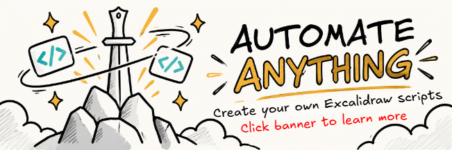

# Automate anything with Excalidraw



Excalidraw Automate scripts are small programs that run inside the Obsidian Excalidraw plugin. They can automate repetitive drawing work, build custom tools and interfaces, work with files in your Obsidian vault, and combine several steps of a workflow into a single command.

The useful question is no longer _“does a community script already exist for this?”_ but _“what would I like Excalidraw to do for me?”_

## The easiest way to create your own script

Use the **[ExcalidrawAutomate script workspace](https://github.com/zsviczian/ea-script-template)**. It is a GitHub template designed for developing one or many Excalidraw Automate scripts with modern tooling and AI coding agents.

The repository already contains:

- Excalidraw Automate API types and reference material for AI agents.
- Agent instructions and practical API-usage examples.
- Script scaffolding, linting, type checking, bundling, and preview support.
- A clean source layout for keeping reusable helpers separate from individual scripts.
- An update workflow so your script repository can receive improvements from the template without replacing your own scripts and guidance.

### Quick start

1. Open [zsviczian/ea-script-template](https://github.com/zsviczian/ea-script-template) and choose **Use this template → Create a new repository**.
2. Clone your new repository and install its dependencies with Node 22.13 or newer.
3. Create a script:

   ```bash
   npm install
   npm run new-script -- --name "My Script"
   ```

4. Tell your AI coding agent what you want the script to accomplish. Describe the workflow, the user interaction, and what should happen on the Excalidraw canvas or in the Obsidian vault.
5. Ask the agent to read the repository instructions and the bundled Excalidraw Automate references before implementing the script.
6. Validate and build:

   ```bash
   npm run check
   npm run build
   ```

7. Copy the generated `.md` script and its preview SVG from `build/` into the Script Engine folder configured in Excalidraw settings. Run the script from an Excalidraw drawing.

The generated `.md` file contains executable JavaScript for the Excalidraw Script Engine; it is not an Obsidian plugin. If `.md` and `.js` versions with the same script name are both present, Excalidraw prefers the `.md` version.

## Why AI agents work so well for scripting

The workflow demonstrated in **[AI Scripting Superpowers](https://youtu.be/6BjhUyfS4iM)** is still the core idea:

1. Give the AI accurate Excalidraw Automate API context.
2. Describe a concrete problem and the behavior you want.
3. Let the AI build a first version.
4. Run it in Obsidian and report the exact error or behavior that needs improvement.
5. Iterate until the workflow feels natural.

The video builds a Layer Manager as an example: a purpose-built tool that did not already exist in the script library. The current script workspace takes this workflow further. Instead of manually feeding a large training document to an AI chat, the repository carries agent instructions, API references, types, examples, and validation tools alongside your source code.

You do not need to start by knowing the Excalidraw Automate API. Start by knowing what you want to automate.

## What can a script automate?

Practically anything that Excalidraw Automate and Obsidian expose, for example:

- Batch-format or rearrange selected elements.
- Build specialized drawing, layout, connector, annotation, or image tools.
- Create custom modals, controls, and persistent sidepanels.
- Create, rename, link, embed, or update files in your vault.
- Generate dashboards or drawings from vault data.
- Add startup, drawing-load, or long-lived automation where appropriate.
- Export drawings, images, or structured information.
- Combine several repetitive actions into a single command tailored to your workflow.

Browse the Community Script Store for examples and inspiration before starting from scratch.

## A few authoring rules worth knowing

The template's authoring guidance handles the details, but these principles matter:

- Excalidraw scene elements are immutable; edit them through the Excalidraw Automate workbench and commit the result back to the view.
- The Script Engine injects `ea` and `utils`. Runtime Obsidian APIs are available through `ea.obsidian`.
- Scripts with UI or long-lived behavior need deliberate cleanup and lifecycle handling.
- Test cancellation, empty selections, undo/save behavior, view changes, and any mobile-specific UI on a physical mobile device.
- Run `npm run check` and `npm run build` before distributing a script.

## Scripts are code

A script can change your drawing and can also work with files in your vault. Treat scripts like any other code you install: use sources you trust, review unfamiliar scripts, keep backups, and test destructive workflows on disposable data first.

## Share a script with the community

Community scripts are maintained in the central [Obsidian Excalidraw repository](https://github.com/zsviczian/obsidian-excalidraw-plugin/tree/master/ea-scripts). If you build something broadly useful, open a focused pull request with the script, its icon/preview, and its Script Store catalog entry.

For repository-specific publishing steps, see [ea-scripts/README.md](../ea-scripts/README.md).

## More resources

- [ExcalidrawAutomate script workspace](https://github.com/zsviczian/ea-script-template)
- [AI Scripting Superpowers](https://youtu.be/6BjhUyfS4iM)
- [Excalidraw Script Engine documentation](https://zsviczian.github.io/obsidian-excalidraw-plugin/ExcalidrawScriptsEngine.html)
- [Excalidraw Automate API declaration](API/ExcalidrawAutomate.d.ts)
