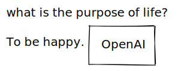

/*


This scripts sends given text to OpenAI with instructions and replaces original text with response.

```javascript
*/

const marginX = 40;
const marginY = 20;

try {
	const elements = ea
		.getViewSelectedElements()
		.filter((el) => el.type == "text");

	const x = elements[0].x;
	const y = elements[0].y;

	let input = '';
	for (let i = 0; i < elements.length; i++) {
	  input += elements[i].rawText.trim();
	  input += '\n';
	}
	if (!input) throw 'text elements should be selected';

	const settingName = "OpenAI Key";
	let settings = ea.getScriptSettings();
	if (!settings[settingName]) {
		const inputPromptKey = await utils.inputPrompt(settingName);

		settings = {
			[settingName]: inputPromptKey
		};
		ea.setScriptSettings(settings);
	}
	const authorizationToken = settings[settingName];
	if (!authorizationToken.startsWith('sk-')) throw 'API Key should be provided';

	const defaultInstruction = "Answer question";
	let instruction = await utils.inputPrompt("Instruction?", defaultInstruction); 
	if (!instruction) instruction = defaultInstruction;
	new Notice(instruction);

	const openaiUrl = 'https://api.openai.com/v1/edits'
	const headers = {
		"Content-Type": "application/json",
		"Authorization": `Bearer ${authorizationToken}`
	};
	const result = await fetch(openaiUrl,{
		method: 'POST',
		headers: headers,
		body: JSON.stringify({
			model: "text-davinci-edit-001",
			input: input,
			instruction: instruction,
			temperature: 0,
			top_p: 1
		})
	}).then(res => res.json()).then(json => json.choices[0].text).catch(err => new Notice(err));

	ea.deleteViewElements(elements);

	ea.addText(
		x,
		y,
		result,
	);

	ea.addElementsToView();
} catch (err) {
  _ = new Notice(err.toString())
}
